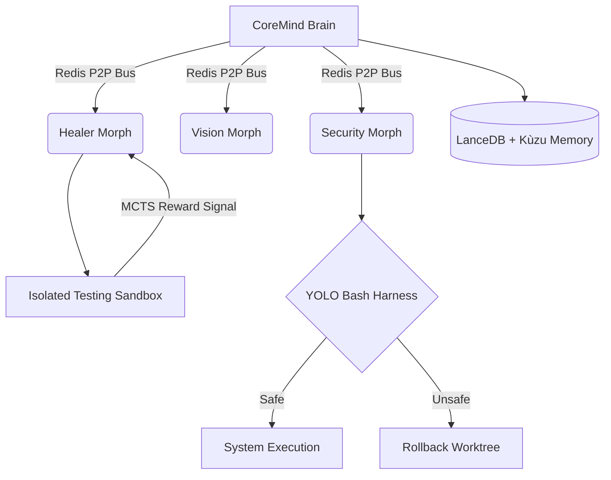

<a name="readme-top"></a>

<div align="center">
  <h1 align="center">🧬 Morphs</h1>

  <p align="center">
    <strong>The First Autonomous System That Assembles Itself.</strong>
    <br />
    An advanced B2B SaaS Business Operating System powered by AI Swarm Orchestration, MCTS-Driven Execution, and fully isolated Sandboxing.
    <br />
    <br />
    <a href="#-architecture"><strong>Explore the architecture »</strong></a>
    <br />
    <br />
    <a href="#-quick-start">Quick Start</a>
    ·
    <a href="https://github.com/helgklaizar/morphs/issues">Report Bug</a>
    ·
    <a href="https://github.com/helgklaizar/morphs/issues">Request Feature</a>
  </p>
</div>

<!-- BADGES -->
<div align="center">
  
  
  
  
  
</div>

<br />

<!-- TABLE OF CONTENTS -->
<details>
  <summary>Table of Contents</summary>
  <ol>
    <li><a href="#about-the-project">About The Project</a></li>
    <li><a href="#-key-features">Key Features</a></li>
    <li><a href="#-architecture">Architecture & Swarm Dynamics</a></li>
    <li><a href="#-component-manifest">Component Manifest</a></li>
    <li><a href="#-getting-started">Getting Started</a></li>
    <li><a href="#-roadmap">Roadmap</a></li>
    <li><a href="#-license">License</a></li>
  </ol>
</details>

---

## 🚀 About The Project

**Morphs** is not a chatbot. It is the world's first fully autonomous Business Operating System. 

It operates as an agile engineering swarm—capable of writing, compiling, testing, repairing, and deploying complex B2B SaaS application codebases. By completely eliminating "blind" LLM hallucinations through strict mathematical inference trees (MCTS), isolated sandboxing (YOLO Guard), and semantic RAG memory, Morphs guarantees that the code it generates compiles, runs, and satisfies your business specifications.

<p align="right">(<a href="#readme-top">back to top</a>)</p>

---

## 🔥 Key Features

| Feature | Description |
| :--- | :--- |
| **🧠 Autonomous Code Assembly** | Generates full B2B SaaS architectures (React/TS UIs, SQLite databases, REST APIs) entirely autonomously from high-level business directives. |
| **🔬 MCTS-Driven Healing** | Implements Monte Carlo Tree Search. The AI tests its own code, catches stack traces, and iteratively patches execution trajectories until the unit tests mathematically prove success. |
| **💾 Infinite RAG Memory** | Utilizes **LanceDB** for embedded semantic similarities and **Kùzu Graph DB** for charting the Abstract Syntax Tree (AST) to understand deep file dependencies. |
| **🛡️ YOLO Injection Guard** | A specialized military-grade neural network that intercepts all shell commands. Catching destructive operations (e.g., `rm -rf`) before they reach `subprocess.Popen`. |
| **⚙️ Native Agentic Tooling** | Seamlessly integrates the Model Context Protocol (MCP), Git Worktree isolation, parallel I/O batching, and Pytest/Playwright native validation. |

<p align="right">(<a href="#readme-top">back to top</a>)</p>

---

## 🏗️ Architecture

Morphs runs on a sophisticated biological mesh architecture, escaping the limitations of linear scripts. 



<p align="right">(<a href="#readme-top">back to top</a>)</p>

---

## 📂 File Structure

```text
morphs/
├── blueprints/        # Template files for dynamic AI generation
├── configurator/      # Desktop Configurator App (React + Tauri)
├── core/              # Main Autonomous Engine & MCTS Logic
├── docs/              # System documentation & architecture
├── sandbox/           # Isolated YOLO environments for code execution
├── scripts/           # Deployment & system utility scripts
├── ui/                # Web Interface / Frontend App
├── workspaces/        # Stateful ephemeral workspaces for Swarm agents
└── test_db/           # Local databases used for testing
```

---
## 🧩 Component Manifest

A complete breakdown of the Morphs AI engineers and system primitives running inside the Swarm network.

<details>
<summary><b>1. System Orchestrators</b></summary>

* `swarm_orchestrator.py`: The P2P Redis event router, facilitating decoupled communication.
* `quantum_atropos.py`: MCTS navigator. Trims pathing trees based on UCB1 success rates.
* `plan_tracker.py`: A Stateful FSM guaranteeing strict, atomic task lifecycles without skipping steps.

</details>

<details>
<summary><b>2. Execution Morphs (The Builders)</b></summary>

* `reactor_morph.py`: Generates the primary React components and backend logics.
* `vision_morph.py`: Leverages Playwright to visually audit the UI components it just created.
* `healer_morph.py` & `backend_healer.py`: Autonomously ingests stack traces and generates runtime patches.
* `db_morph.py`: Designs and migrates functional database schemas dynamically.

</details>

<details>
<summary><b>3. Guardians & Security (YOLO)</b></summary>

* `bash_harness.py` & `yolo_classifier.py`: The unbypassable security layer analyzing semantic payloads before shell execution.
* `verification_morph.py`: Independent E2E test verification to ensure the agent doesn't hallucinate "fake passes".
* `audit_morph.py`: Enforces Clean Code and SOLID principles across the AST.

</details>

<details>
<summary><b>4. Memory & Context Engines (RAG)</b></summary>

* `query_engine.py`: Unified interface bridging Vector DB (Lance) and Graph DB (Kùzu).
* `atropos_memory.py`: Reinforcement Learning trajectory storage. Learns from failed executions.
* `graph_rag.py`: Dynamically constructs interactive dependency maps from raw source code formats.

</details>

<p align="right">(<a href="#readme-top">back to top</a>)</p>

---

## 💻 Tech Stack

* **AI & Orchestration:** Python 3.12+, Apple MLX, Gemini API, MCTS Atropos RL, Configurable Prompts
* **Messaging & Data:** Redis, MsgSpec, LanceDB, Kùzu, DuckDB, SQLite
* **Frontend Ecosystem:** React, Vite, Tailwind CSS, TypeScript, Bun
* **Environment:** Docker, Pytest-Asyncio, Git Worktrees

<p align="right">(<a href="#readme-top">back to top</a>)</p>

---

## 🏃 Getting Started

### Prerequisites
Morphs operates heavily on local sandboxes. Ensure you possess:
* `python` >= 3.12
* `docker` and `docker-compose`
* `bun` & `node` (for UI compilation layers)

### Installation
1. Clone the repository:
   ```sh
   git clone https://github.com/helgklaizar/morphs.git
   cd morphs
   ```
2. Start the fundamental background databases (Redis & Lance):
   ```sh
   docker compose up -d redis lancedb
   ```
3. Set up the Python core layer:
   ```sh
   cd core
   python3 -m venv venv
   source venv/bin/activate
   pip install -r requirements.txt
   ```
4. Initialize your local graph/vector DB structures:
   ```sh
   python3 scripts/setup_db.py
   ```
5. Ignite the Swarm Orchestrator (Main API):
   ```sh
   uvicorn main:app --host 127.0.0.1 --port 8000 --reload
   ```

<p align="right">(<a href="#readme-top">back to top</a>)</p>

---

## 🗺️ Roadmap

- [x] **Epic 0**: Full Architecture Stabilization & Mock Replacement (Complete)
- [ ] **Epic 1**: Local B2B SaaS React Configurator
- [ ] **Epic 2**: Terminal Interactivity & Live Node CLI
- [ ] **Epic 3**: Atropos RL Model Fine-Tuning Integration

<p align="right">(<a href="#readme-top">back to top</a>)</p>

---

## 📄 License

Distributed under the MIT License. See `LICENSE` for more information.

<p align="right">(<a href="#readme-top">back to top</a>)</p>

---

> *"We don't write code. We grow systems that assemble themselves."*  
> — **Antigravity Engineering (2026)**
