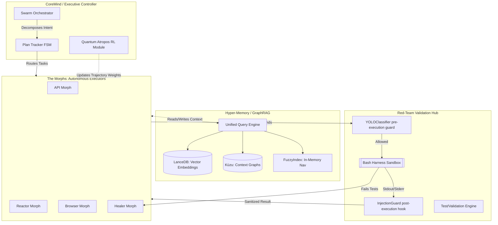

# Morphs Business OS: Core Architecture

The Morphs architecture represents a paradigm shift from linear LLM wrappers to a biologically-inspired, self-healing, multi-agent swarm. Built on an advanced Reinforcement Learning (RL) foundation, Morphs dynamically assembles, plans, mutates, and validates software components in real-time.

## 1. System Topology

The system is partitioned into five distinct layers, maintaining strict isolation between planning (Brain), execution (Swarm), and validation (Sandbox).

## 2. Core Operational Mechanics

### A. The Brain (SwarmOrchestrator & CoreMind)
At the top of the hierarchy sits the `SwarmOrchestrator`, which receives natural language intents or parsed blueprints via the `DeployMorph`.
- **Stateful Planning:** Flat TODO lists are abandoned in favor of the `PlanTracker`. The tracker enforces a finite state machine representing task lifecycles (Idle -> Scoping -> Executing -> Verifying -> Done).
- **Quantum Atropos (MCTS):** Uses a Monte-Carlo Tree Search implementation. Instead of linearly guessing code, the engine explores branches of architectural possibilities, simulating rollouts before committing code to disk.

### B. The Swarm (Morphs)
Different agents interact asynchronously via the `Event Bus` and `Debate Bus`. 
See `agents_manifest.md` for a complete breakdown of all executing specialized Morphs (e.g., `CodeSmellMorph`, `WatchdogMorph`, `ReactorMorph`).

### C. The Hyper-Memory Layer
Rather than stuffing a 2M token context window, Morphs utilizes dynamic context retrieval:
- **GraphRAG (Kùzu):** Maps relationships between files, APIs, components, and semantic intents.
- **Vector Search (LanceDB):** Enables deep semantic similarity queries across documentation and source code using `sentence-transformers`.
- **FuzzyIndex:** An ultra-fast, in-memory trie/graph for rapid regex and path traversals without incurring LLM cost.

### D. Continuous Reinforcement Learning (Atropos RL)
With `AtroposTrainer` and `AtroposMemory`, every action performed by a Morph within the `BashHarness` is recorded as a trajectory.
- **Positive Rewards:** Passed tests, syntax-verified ASTs, successful `pytest` runs.
- **Negative Penalties:** Hallucinations, sandbox crashes, or prompt-injection attempts.
The RL module refines weights continuously, allowing the AI to "learn" the structure of the active repository dynamically.

## 3. Invocation Pattern
1. **Trigger:** `main.py` -> `CoreMind.execute(intent)`
2. **Decomposition:** `PlanTracker` chunks intent.
3. **Execution:** Specific Morphs are spawned asynchronously.
4. **Validation:** `VerificationMorph` tests the result inside `BashHarness`.
5. **Recovery:** If tests fail, `BackendHealer` steps into a fast feedback loop, fixing the AST iteratively.
6. **Commit:** Only verified, sanitized, and type-checked code is merged into the host environment.
