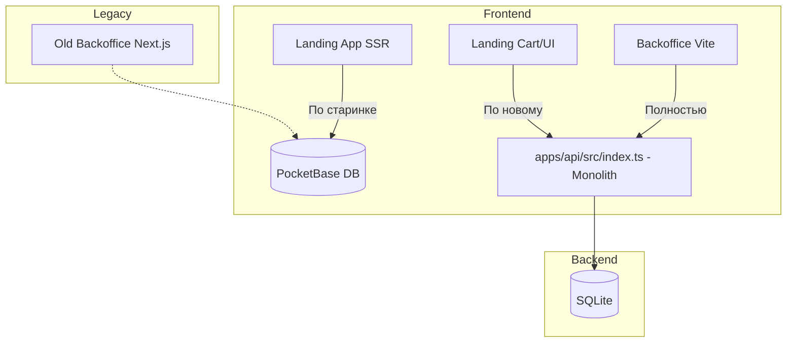

# Архитектурный Аудит V2 (Borsch Core MVP Phase 2)

> **Статус**: Открыт
> **Фаза**: Завершение переезда на Hono / Vite.

## 1. Проблематика (Bottlenecks & Pain Points)

После успешного FSD-рефакторинга `packages/core` и Лендинга, а также перевода Кассы на Hono API, были выявлены следующие **новые/оставшиеся** архитектурные проблемы:

### 🍝 Проблема 1: Монолитный Бэкенд (apps/api/src/index.ts)
**Описание:** Весь API-слой (CRUD Меню, Заказы, Категории, Клиенты, SSE вебсокеты, Хэндлеры для Телеграма) написан в одном файле `index.ts` (~286 строк).
**Следствие:** Нарушение разделения ответственности (Separation of Concerns). При добавлении новых фичей файл превращается в "God Object". 

### 🕸️ Проблема 2: Жесткая связка Лендинга с PocketBase
**Описание:** Клиентский слой корзины мы переключили на Hono, но **SSR-рендер Лендинга** (`apps/landing/src/app/page.tsx`) до сих пор стучится в PocketBase для получения настроек (`landing_settings`), категорий (`menu_categories`) и переводов (`translations`). 
**Следствие:** Мы не можем полностью избавиться от PocketBase и отвязать проект от старой БД.

### 💀 Проблема 3: Наследие и Мёртвый Код
**Описание:** Приложение `apps/backoffice` (на Next.js) всё ещё находится в монорепе и импортируется пакетными менеджерами.
**Следствие:** Увеличение времени установки зависимостей, путаница в точках входа, засорение IDE поиска.

### 🔒 Проблема 4: Хаос Конфигурации (Environment Variables)
**Описание:** В проекте разбросаны устаревшие константы и хардкоды `http://localhost:3002/api/events`.

---

## 2. Диаграммы (Mermaid)

### Текущее состояние (Phase 2 Transitional)



### Целевое состояние (Final Architecture)

```mermaid
graph TD
    subgraph Frontend
        Landing[Landing App] --> Hono_Clean
        Vite[Backoffice Vite] --> Hono_Clean
    end
    
    subgraph Backend (apps/api/src)
        Hono_Clean[Hono App]
        Hono_Clean --> RouteOrders[routes/orders.ts]
        Hono_Clean --> RouteMenu[routes/menu.ts]
        Hono_Clean --> RouteCore[routes/system.ts]
        
        RouteOrders --> Prisma[(SQLite)]
        RouteMenu --> Prisma
        RouteCore --> Prisma
    end
```

---

## 3. Целевой паттерн: Clean API + FSD Frontend

1. **Clean API Architecture:** Разбиение `apps/api` на роутеры (Routes / Controllers) по образу доменов в `packages/core` (Domain-Driven Pruning).
2. **Backend-For-Frontend (BFF):** Hono становится единственной прослойкой между БД и Лендингом. PocketBase отключается полностью.
3. **Hard Deletion (Pruning):** Физическое удаление старой административной панели для разгрузки монорепы.

---

## 4. Roadmap (Пошаговый план миграции)

1. [ ] **Backend Refactoring:** Распилить `apps/api/src/index.ts` на отдельные модули роутов (`routes/orders.ts`, `routes/menu.ts`, `routes/events.ts`).
2. [ ] **Hono Expansion:** Реализовать в Hono недостающие эндпоинты (`landing_settings`, `translations`).
3. [ ] **Landing BFF Switch:** Переписать `apps/landing/src/app/page.tsx` с `PocketBase` на Hono API `localhost:3002`.
4. [ ] **Purge Legacy:** Удалить `apps/backoffice` и зачистить хардкоды `.env`.
5. [ ] **E2E Playwright:** Итоговый E2E-тест заказа и кассы (через `/e2e-playwright-run`).
