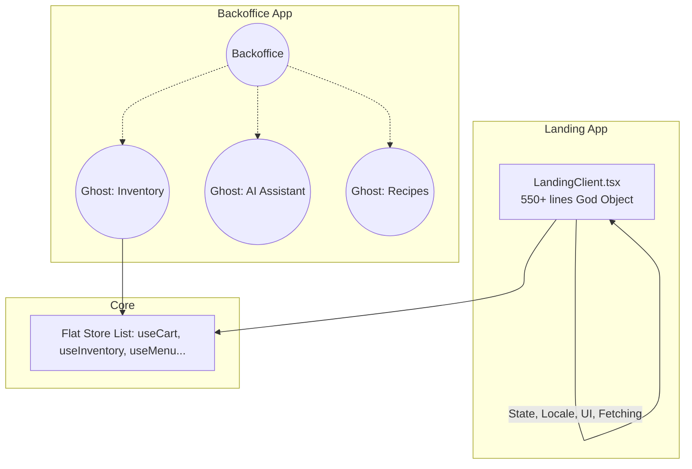

# Архитектурный Аудит (Borsch Core MVP)

## 1. Проблематика (Bottlenecks & Pain Points)

В ходе сканирования монорепозитория (Turborepo + pnpm) `apps/backoffice`, `apps/landing` и `packages/core` были выявлены следующие архитектурные проблемы:

### 👻 Проблема 1: "Призрачный код" и Нарушение границ (God Objects)
Согласно текущей стратегии (зафиксированной в `GEMINI.md`), из Backoffice были вырезаны модули Финансов, Списания, Складов, Рецептов, а также AI-ассистент. 
Однако фактически в проекте остались "хвосты" и мертвый код:
- В `apps/backoffice/src/app/(protected)` всё ещё лежат папки `inventory`, `purchases`, `recipes`.
- В `packages/core/src/store/` живы `useInventoryStore.ts`, `useRecipesStore.ts`, `useAiStore.ts`, `useAiSettingsStore.ts`.
- В `apps/backoffice/src/components` оставлены огромные компоненты `AiAssistantOverlay.tsx` (14KB) и `AiSidebar.tsx`, а также папка `ai`.
**Следствие:** Нарушение принципа единой ответственности, утяжеление бандла, путаница (God Objects хранят логику, которая де-факто отключена на уровне бизнес-требований).

### 🏗️ Проблема 2: Монолитные UI-компоненты (Landing)
Файл `apps/landing/src/components/LandingClient.tsx` раздут до ~550 строк (34KB) и выполняет роль God Component:
- Управление стейтом (Zustand: Cart, Locale).
- Анимации (Framer Motion).
- Рендеринг сложного многоуровневого UI (Hero, Модалки языков, Карточки еды, Sticky Header).
- Логика шаринга, проверки доступности по времени и фильтрации категорий.
**Следствие:** Сложность поддержки, жесткая связанность бизнес-логики и UI. При изменении логики добавления в корзину перерендеривается и пересчитывается вся посадочная страница.

### 🧩 Проблема 3: Плоская структура Core / Состояние зависимостей
В `packages/core/src` все stores и api свалены в одну плоскую структуру. Нет разделения по **доменам/фичам** (Feature-Sliced). 

---

## 2. Диаграммы (Mermaid)

### Текущее состояние (Monolith in Next.js)



### Целевое состояние (Feature-Sliced Design)

```mermaid
graph TD
    subgraph Landing App
        Page[Page]
        Page --> WidgetHero[Widget: Hero Banner]
        Page --> WidgetMenu[Widget: Menu List]
        WidgetMenu --> FeatureCart[Feature: Add to Cart]
        WidgetMenu --> FeatureLocale[Feature: Change Locale]
        WidgetMenu --> EntityProduct[Entity: Product Card]
    end
    
    subgraph Backoffice App
        BO_Clean((Backoffice: Pos / Orders / Menu))
    end
    
    subgraph Core Packages
        DomainOrders[Domain: Orders Store & API]
        DomainCatalog[Domain: Catalog / Menu]
        DomainAuth[Domain: Auth]
        DomainOrders --> BO_Clean
        DomainCatalog --> Landing App
    end
```

---

## 3. Целевой паттерн: FSD (Feature-Sliced Design) + Domain-Driven Pruning

Рекомендованная методология: **Упрощенный Feature-Sliced Design** для фронтенда и строгое разделение логики по доменам (Domain-Driven Pruning).
- Слой `features`: Действия (добавить в корзину, поменять язык).
- Слой `entities`: Сущности (карточка блюда, ордер).
- Слой `widgets`: Изолированные блоки (Header, MenuGrid).
- Жесткая чистка (Pruning): Полное удаление папок, роутов и сторов, которые не относятся к MVP.
