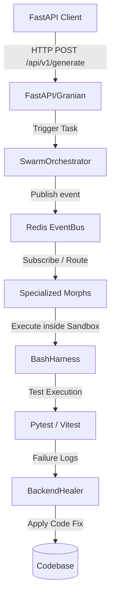

# Архитектура системы (Architecture)

Система **Morphs Business OS** представляет собой автономную распределенную среду разработки B2B SaaS-приложений, построенную на концепции **децентрализованных специализированных агентов (Morphs)**. Проект спроектирован так, чтобы быть полностью изолированным, безопасным и способным к самовосстановлению.

---

## 1. Концептуальная архитектура (Hexagonal Architecture)

В ядре системы реализован подход гексагональной архитектуры (Ports & Adapters), разделяющий бизнес-логику и внешние интерфейсы:
* **Ядро (Core Domain)**: Описано в `ml_workers/core/domain/` (модели событий, правила переходов состояний).
* **Порты (Ports)**: Интерфейсы взаимодействия в `ml_workers/core/application/ports.py`.
* **Адаптеры (Adapters)**: Конкретные реализации ввода-вывода (например, `mlx_adapter.py`, `sqlite_adapter.py`), лежащие в `ml_workers/infrastructure/`.

Это позволяет легко заменять используемые LLM (например, переходить с локального инференса Apple MLX на удаленный Google Gemini) без изменения логики координации.

---

## 2. Модель взаимодействия агентов (Swarm & EventBus)

Взаимодействие между агентами происходит асинхронно через шину событий **EventBus** на базе Redis:

* **`SwarmOrchestrator`** — главный диспетчер. Он разбивает высокоуровневую цель на подзадачи с помощью дерева MCTS (Monte Carlo Tree Search), следит за их выполнением и координирует дебаты между агентами (`Debate Bus`).
* **`PlanTracker`** — конечный автомат (FSM), хранящий текущее состояние планов и предотвращающий бесконечные циклы работы LLM.

---

## 3. Гибридный слой памяти (Memory Layer)

Память системы распределена по трем различным базам данных для обеспечения эффективного поиска контекста:
1. **SQLite (`morphs_system.db`)**:
   * Хранит метаданные синхронизации (`sync_metadata`), текущие задачи (`tasks`) и предложенные изменения кода (`mutations`).
   * Схема описана в `wiki/pages/schema.sql`.
2. **LanceDB (`.lancedb/`)**:
   * Векторная база данных. Хранит семантические эмбеддинги исходного кода проекта (384-мерные векторы, сгенерированные через `sentence-transformers`).
   * Позволяет `QueryEngine` выполнять полнотекстовый и семантический RAG-поиск по репозиторию.
3. **Kùzu (`.kuzu_graph/`)**:
   * Встраиваемая графовая СУБД. Хранит AST (абстрактное синтаксическое дерево) проекта и зависимости между файлами, классами и функциями.
   * `CodeLensMorph` использует её для определения связанных модулей. Например, при изменении схемы БД графовый поиск автоматически находит и загружает в контекст LLM связанные контроллеры и компоненты UI.

---

## 4. Защищенный контур выполнения (Red-Team Sandbox)

Поскольку Morphs могут выполнять произвольный bash-код, безопасность гарантируется трехэтапным контуром защиты:
1. **Пре-выполнение (`YOLOClassifier`)**:
   Перехватывает команду до отправки в shell. Анализирует её на критические угрозы (например, `rm -rf /`, удаление системных файлов). При критическом риске выполнение блокируется. При среднем риске запрашивается ручное подтверждение через `dialog_launchers`.
2. **Изолированный запуск (`BashHarness`)**:
   Команда выполняется в эмулируемом `PTY` (псевдотерминале). Доступ к файловой системе вне воркспейса жестко ограничен. Для масштабных изменений кода создается изолированный `git worktree`.
3. **Пост-выполнение (`InjectionGuard`)**:
   Сканирует вывод команды (`stdout`) на попытки prompt-injection ("Ignore all previous instructions..."). Обнаруженные инъекции вырезаются или маскируются в тег `[REDACTED: Injection Blocked]`, а вокруг вывода оборачиваются XML-теги `<system-reminder>` для удержания LLM в безопасном состоянии.
